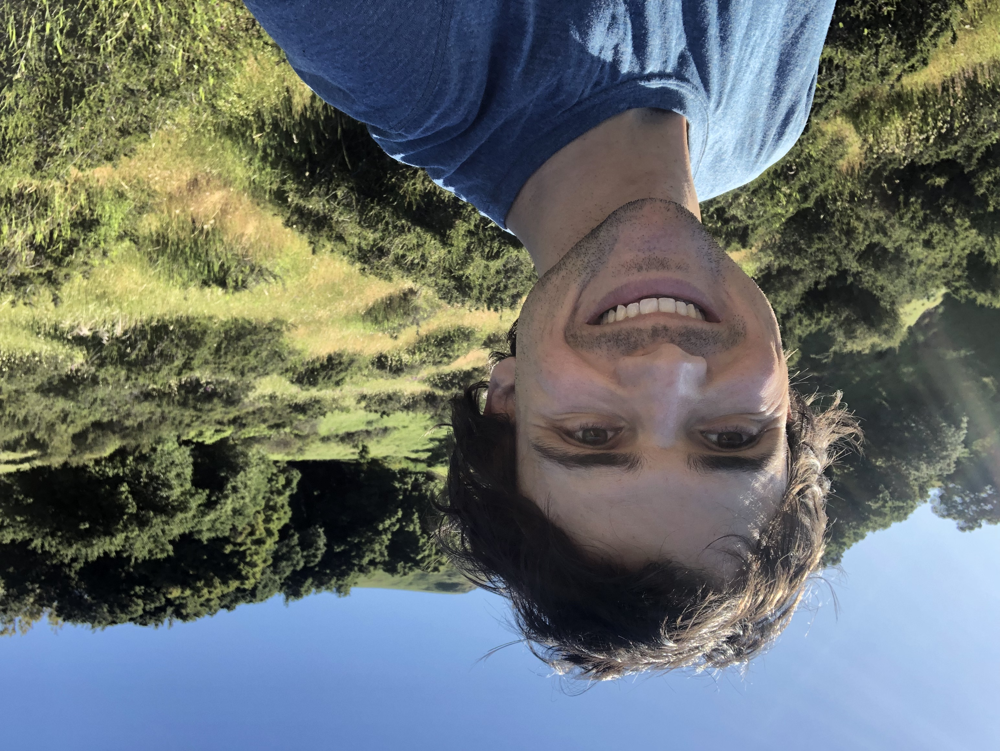

]{: .image-left }

I currently build build deep learning systems for multi-camera, machine vision problems at [Standard Cognition](https://standard.ai/). I have mainly been focused on model training automation and transfer learning and domain adaptation systems for reducing generalization error in production. 

In my research, I am interested in AI topics such as developing more intelligent meta-learning algorithms and bounds on their generalization and optimality. On longer term topics, I am interested in models that can develop explanations, introspect their own uncertainty, and communicate with us. Research into these lines of inquiry should elucidate fundamental properties of the nature of intelligence.

[Curriculum vitae](./assets/Sean_Hendryx_CV.pdf)
